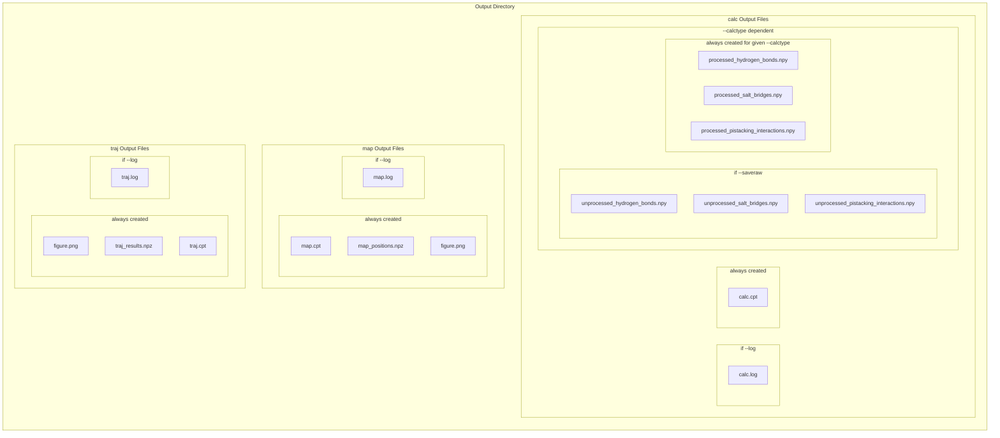

<div class="row">
    <div class="col-sm mt-3 mt-md-0">
        
    </div>
</div>

Fibmap is an automated tool for calculating and displaying the intermolecular forces (Salt Bridges, Hydrogen Bonds, and Pi Stacking interactions) within a finite amyloid fibril model from a PDB file or Molecular Dynamics trajectory.  

Developed by Conor B. Abraham in the Straub Group at Boston University, Department of Chemistry

## Disclaimer

FibMap is still a work in progress. If you run into any issues please report them [here](https://github.com/conor-b-abraham/FibMap/issues).

## Background and Motivation

Naturally formed amyloid fibrils can be categorized into two groups: (1) Functional amyloid fibrils, such as the premelanosome protein 17 (Pmel17) fibril that enables melanin synthesis, serve many vital biological roles [[1,2]](#references). (2) Pathogenic amyloid fibrils, such as the β-Amyloid (Aβ) fibril of Alzheimer’s Disease and the Serum Amyloid A (SAA) fibril of Systemic AA Amyloidosis, are effective disease-causing agents [[2]](#references). Amyloid fibrils are defined by their elongated and unbranched amyloid scaffold that is composed of cross-β sheet stacked monomers that are parallel (N-terminus to N-terminus and C-terminus to C-terminus) and in-register (residues are aligned with matching residues in adjacent layers) [[2,3]](#references). They can contain one or more parallel stacks of monomers, called protofilaments. The residues that are not a part of the amyloid scaffold make up intrinsically disordered regions at the exterior of the fibril. Despite all containing the amyloid scaffold, a broad variety of amyloid fibril structures have been identified, and individual amyloid proteins can form multiple polymorphs. Such polymorphism has been detected for many pathogenic amyloids [[4–10]](#references).

FibMap.py was created to aid the analysis of the evergrowing collection of amyloid fibrils available on the [RCSB PDB Protein Data Bank](https://www.rcsb.org/) and to understand commonalities and differences among amyloid fibril polymorphs. 

<div class="row">
    <div class="col-sm mt-3 mt-md-0">
        
    </div>
</div>
<div class="caption">
    Figure 1: FibMap creates an informative figure displaying the residues and key contacts within an amyloid fibril. The image on the left was created using Visual Molecular Dynamics (VMD) [[11]](#references). The shown fibril is the human Serum Amyloid A fibril (<a href='https://doi.org/10.2210/pdb6MST/pdb'>PDB 6MST</a>)[<a href='https://conor-b-abraham.github.io/projects/1_FibMap/#references'>12</a>].
</div>

## Methodology

### Hydrogen Bonds
FibMap uses MDAnalysis's Hydrogen Bond Analysis tool for calculating hydrogen bonds. Please see the [MDAnalysis Documentation](https://docs.mdanalysis.org/stable/documentation_pages/analysis/hydrogenbonds.html) for more information.

Potential hydrogen bond acceptors and hydrogens are guessed using the atom charge information. An atom whose charge is less than -0.5e is considered a potential acceptor. Atoms with a mass greater than 0.9u and less than 1.1u and a charge greater than 0.3e are considered potential hydrogen bonded hydrogens. Potential hydrogen bond donors are inferred from the list of potential hydrogen bonded hydrogens.

<div class="row">
    <div class="col-sm mt-3 mt-md-0">
        
    </div>
</div>
<div class="caption">
    Figure 2: Schematic showing $$\theta_{D-H-A}$$ and $$D_{D-A}$$ of a hydrogen bond. For a given set of a potential hydrogen bond donor and hydrogen and a potential hydrogen bond acceptor, $$\theta_{D-H-A}$$ and $$D_{D-A}$$ must be below their cutoff.
</div>

Hydrogen bonds are identified from sets of potential hydrogen bonds donors, acceptors, and hydrogens using a donor-acceptor distance cutoff ($$D_{D-A}$$, Default: 3.5Å) and a donor-hydrogen-acceptor angle cutoff ($$\theta_{D-H-A}$$, Default: 150°) as shown in Figure 2. These cutoffs can be changed from the commandline or with an input file if desired (See [Usage: calc: Parameters](#parameters)).

### Salt Bridges
FibMap calculates salt bridges by identifying charged residues and calculating the minimum distance between the charged regions on their sidechains. If the minimum distance between a cation and an anion is below the distance cutoff (Default: 4Å) it is counted as a salt bridge (Figure 3). The distance cutoff for a salt bridge can be changed from the commandline or with an input file if desired (See [Usage: calc: Parameters](#parameters)).

Determination of charged residues capable of forming salt bridges can be done manually or automatically. The salt bridge group determination method and its associated parameters can be set from the commandline or with an input file (See [Usage: calc: Parameters](#parameters)). If done manually, the user can select the residue names and atom names they want to include in the calculation. The default names for manual determination are based on the CHARMM36 force field atom and residue names and are set to include aspartic acid and glutamic acid as anions and lysine, arginine, and basic histidine as cations (Table 1).

| Type | Residue | Residue Name(s) | Atom Names |
|---|---|---|---|
| Anion | Aspartic Acid | ASP | OD1, OD2 |
| Anion | Glutamic Acid | GLU | OE1, OE2 |
| Cation | Lysine | LYS | NZ |
| Cation | Arginine | ARG | NH1, NH2, NE |
| Cation | Basic Histidine | HSP | ND1, NE2 |

> Table 1: Default residue and atom names used for the manual salt bridge group selector mode.

<div class="row">
    <div class="col-sm mt-3 mt-md-0">
        
    </div>
</div>
<div class="caption">
    Figure 3: Schematic showing the automatic salt bridge group determination method and distances. For lysine (left), the overall charge of the NH<sub>3</sub> group is 0.69e. Because this is the largest charge on the lysine sidechain, the NZ atom will be used as a reference point. For aspartic acid (right) the OD1 and OD2 atoms each carry a -0.76e charge. Assuming this is below the anion charge cutoff, both atoms will be used as reference points. As aspartic acid has 2 reference points and lysine has 1 reference point, two distances are computed, $$D_{NZ-OD1}$$ and $$D_{NZ-OD2}$$. At least one of these distances must be below the salt bridge distance cutoff for it to count as a salt bridge.
</div>

If done automatically, charged residues are identified using the atom charges in the topology. Then, for each heavy atom in a charged residue, the total charge of that atom and any connected hydrogens is computed (Figure 3). For anions, if the total charge is less than the charge cutoff (Default: -0.5e), the heavy atom is added to the charged region for that atom. For cations, if the total charge is greater than the charge cutoff (Default: 0.5e), the heavy atom is added to the charged region for that atom. If no heavy atom meets the cutoff requirement for an acidic or basic residue, the heavy atom closest to the cutoff will be used and a warning will be thrown.

### Pi Stacking Interactions

<div class="row">
    <div class="col-sm mt-3 mt-md-0">
        
    </div>
</div>
<div class="caption">
    Figure 4: Various measures used in finding and categorizing pi stacking interactions. Based on Fig. 2 from Zhao et al. (2015) [[13]](#references).
</div>

To calculate pi-stacking interactions, FibMap follows the methodology developed by Zhao et al. [[13]](#references). For the ring of each phenylalanine, tyrosine, histidine, and tryptophan residue, we define its normal vector ($$\mathbf{n_i}$$), ring plane vector ($$\mathbf{r_i}$$), and centroid (Figure 4). Then, for each pair of rings, we calculate their centroid-centroid distance ($$\mathrm{R_{cen}}$$), the acute angle between the centroid-centroid vector and $$\mathbf{r_1}$$ ($$\theta$$), the acute angle between the centroid-centroid vector and $$\mathbf{r_2}$$, and the acute angle between $$\mathbf{n_1}$$ and $$\mathbf{n_2}$$ (Figure 4).

Any pair with $$\mathrm{R_{cen}} \leq 7.2$$ Å could be a pi stacking interaction, so we define its type (Figure 5). If $$\theta \lt 30^{\circ}$$ and $$\delta \lt 30^{\circ}$$, its a spurious interaction (not a pi stacking interaction). If $$\gamma \lt 50^{\circ}$$, it's a T-shaped pi stacking interaction. If $$30^{\circ} \leq \gamma \leq 50^{\circ}$$, it's an intermediate pi stacking interaction. If $$\gamma \lt 30^{\circ}$$ and either $$\theta \gt 80^{\circ}$$ or $$\delta \gt 80^{\circ}$$, its a sandwich pi stacking interaction. If $$\gamma \lt 30^{\circ}$$ and neither $$\theta \gt 80^{\circ}$$ nor $$\delta \gt 80^{\circ}$$, its a parallel displaced pi stacking interaction.

<div class="row">
    <div class="col-sm mt-3 mt-md-0">
        
    </div>
</div>
<div class="caption">
    Figure 5: The three main types of pi stacking interactions (Sandwich, T-Shaped, and Parallel Displaced). Intermediate pi stacking interactions (not shown) are between Sandwich and T-Shaped geometry. Based on Fig. 1 from Zhao et al. (2015) [[13]](#references).
</div>

At this time, the calculation of pi stacking interactions depends upon residue and atom names. In the future, I would like to completely remove naming dependence from the program, but for now this is the only part of the program that still relies on it. By default, the program uses the CHARMM36 forcefield residue and atom names (Table 2). These names can be changed from the commandline or using an input file (See [Usage: calc: Parameters](#parameters)).

| Residue | Residue Name(s) | Atom Names |
|---|---|---|
| Phenylalanine | PHE | CG, CD2, CE2, CZ, CE1, CD1 |
| Tyrosine | TYR | CG, CD2, CE2, CZ, CE1, CD1 |
| Histidine | HSD, HSE, HSP | CG, CD2, NE2, CE1, ND1 |
| Tryptophan | TRP | CG CD1, NE1, CE2, CD2 |

> Table 2: The default residue and atom names used to select the aromatic rings that could participate in a pi stacking interaction. *NOTE: Notice that the 5-membered ring (not the 6-membered ring) is used for Tryptophan. This follows the guidance of Zhao et al (2015) [[13]](#references).*

### Probabilities

The goal with calculating the probabilities (or average number of) a given type of interaction within the fibril is to have the probability reflect that of an infinite fibril. 

> *NOTE: For pi stacking interactions, the processed results file will contain values for* $${P(Sandwich)}$$*,* $$P(T-Shaped)$$*,* $$P(Intermediate)$$*, and* $$P(Parallel \text{ } Displaced)$$*, as well as,* $$P(Total)$$*.* $$P(Sandwich)$$*,* $$P(T-Shaped)$$*,* $$P(Intermediate)$$*, and* $$P(Parallel \text{ } Displaced)$$ *are computed after* $$P(Total)$$ *(i.e. they tell you the probability that the pi stacking interaction is of that kind IF it exists). The probability cutoff for displaying a pi stacking interaction on the FibMap is only applied to* $$P(Total)$$*.*

#### Interlayer Interactions
For interlayer interactions, this means that the probabilties need to be adjusted to reflect the fact that in a finite fibril model (such as the Cryo-EM structures deposited on the PDB databank), the terminal layers of the fibril are unable to form the interaction. We also have to consider that in our FibMap representation, sidechains are represented by a single point, so for some sites and types of interactions multiple interactions may occur (e.g. Arginine sidechains can form multiple hydrogen bonds). Finally, because the layers of some fibrils are 'staggered', interlayer interactions involving a given layer could occur between that layer and multiple other layers. For example, consider two sites, A and B, on a 4 layer fibril (Figure 6).

<div class="row">
    <div class="col-sm mt-3 mt-md-0">
        
    </div>
</div>
<div class="caption">
    Figure 6: Two interaction sites on a four layer fibril forming $$\Delta \ell=1$$ and $\Delta \ell=2$ interactions.
</div>

On the FibMap, we will be representing two different interactions with the same representation, an $$A_{i}\text{ }to\text{ }B_{i+1}$$ interaction and an $$A_{i}\text{ }to\text{ }B_{i+2}$$ interaction. When calculating this probability we have to account for the fact that a maximum of 3 $$A_{i}\text{ }to\text{ }B_{i+1}$$ interactions can occur and a maximum of 2 $$A_{i}\text{ }to\text{ }B_{i+2}$$ interactions can occur. We also have to account for the fact that in the case that a single interaction does not occur, it does not necessarily change the overall probability of an $$A_{i}\text{ }to\text{ }B_{j \neq i}$$ interaction (e.g. if $$A_{4}\text{ }to\text{ }B_{3}$$ does not occur, but the probability of an $$A_{i}\text{ }to\text{ }B_{i+2}$$ is 1, then the overall probability of an $$A_{i}\text{ }to\text{ }B_{j \neq i}$$ interaction is still 1). So, the overall probability of an $$A_{i}\text{ }to\text{ }B_{j \neq i}$$ interaction at a given timestep, $$f$$, is given by:

$$p_{A_{i} \text{ } to \text{ } B_{j \neq i}}(f) = \mathrm{max} \left\lbrace p_{A_{i} \text{ } to \text{ } B_{i+1}}(f), \text{ } p_{A_{i} \text{ } to \text{ } B_{i+2}}(f), \text{ } p_{A_{i} \text{ } to \text{ } B_{i+1, i+2}}(f) \right\rbrace,$$

where $$p_{A_{i} \text{ } to \text{ } B_{i+1}}(f)$$ is the probability that eligible sites are bound by an $$A_{i} \text{ } to \text{ } B_{i+1}$$ interaction, $$p_{A_{i} \text{ } to \text{ } B_{i+2}}(f)$$ is the probability that eligible sites are bound by an $$A_{i} \text{ } to \text{ } B_{i+2}$$ interaction, and $$p_{A_{i} \text{ } to \text{ } B_{i+1, i+2}}(f)$$ is the probability that elibile sites are bound by either an $$A_{i} \text{ } to \text{ } B_{i+1}$$ interaction or an $$A_{i} \text{ } to \text{ } B_{i+2}$$ interaction. We compute these subprobabilities by considering the number of sites involved in each interaction rather than by considering the number of interactions themselves, allowing us to extrapolate to an infinite fibril. These subprobabilities are given by:

$$p_{A_i \text{ } to \text{ } B_{i + \Delta \ell}}(f) = \frac{n_{s,bound}}{n_{s,eligible}},$$

where $$n_{s,eligible}=2(n_{layers}-\Delta \ell)$$ is the number of eligible interaction sites given the fibril model (e.g. for the above example, $$n_{s,eligible}=6$ for $p_{A_{i} \text{ } to \text{ } B_{i+1}}(f)$$, $$n_{s,eligible}=4$$ for $$p_{A_{i} \text{ } to \text{ } B_{i+2}}(f)$$, and $$n_{s,eligible}=6$$ for $$p_{A_{i} \text{ } to \text{ } B_{i+1,i+2}}(f)$$). Here, $$\Delta \ell$$ is the number of layers spanned by a given subtype (e.g. $$\Delta \ell (A_{i} \text{ } to \text{ } B_{i+1}) = 1$$ and $$\Delta \ell (A_{i} \text{ } to \text{ } B_{i+2}) = 2$$), or the minimum $$\Delta \ell$$ for the combined subprobability (e.g. $$\Delta \ell (A_{i} \text{ } to \text{ } B_{i+1, i+2}) = 1$$), and $$n_{layers}$$ is the total number of layers in the fibril. $$n_{s, bound}$$ is the number of those sites involved in a given interaction (or in either interaction for the combined subprobability). We then take the ensemble average of the overall probability at each frame for each interaction: 

$$P(A_i \text{ } to \text{ } B_{j\neq i})=\frac{1}{n_{f}}\sum_f^{n_f} p_{A_{i} \text{ } to \text{ } B_{j \neq i}}(f).$$

For Hydrogen Bonds, since more than one may form between a pair of sites, you also have the option to use a average number of interactions, $$\langle N_{HB} \rangle$$ cutoff for the FibMap. For an individual frame, the average number of interactions for a given pair of interaction sites is given by:

$$N_{A_i \text{ } to \text{ } B_{j\neq i}}(f) = \frac{2(n_{interactions})}{n_{s, weighted}},$$

where, 

$$n_{s,weighted} = \sum_{\Delta \ell}^{n_{\Delta \ell}}(2(n_{layers}-\Delta \ell)/n_{\Delta \ell}),$$ 

and $$n_{\Delta \ell}$$ is the number of subtypes for this type of interaction (e.g. $$n_{\Delta \ell}=2$$ for our above example).

Finally, we take the ensemble average of the overall average number of interactions for each frame:

$$\langle N(A_i \text{ } to \text{ } B_{j\neq i}) \rangle=\frac{1}{n_{f}}\sum_f^{n_f} N_{A_{i} \text{ } to \text{ } B_{j \neq i}}(f).$$

#### Intralayer Interactions

For intralayer interactions, such complexity is not needed. At each frame, the probability is computed by taking the number of interacting sites and dividing it by the number of total sites:

$$p_{A_i \text{ } to \text{ } B_i}(f) = \frac{n_{s,bound}}{n_{s}},$$

where $$n_s=2n_{layers}$$ is the total number of sites. Similarly, the number of interactions per site is given by:

$$N_{A_i \text{ } to \text{ } B_i}(f) = \frac{2(n_{interactions})}{n_{s}}.$$

Then, $$P(A_i \text{ } to \text{ } B_i)$$ and $$\langle N(A_i \text{ } to \text{ } B_i) \rangle$$ are then computed in the same manner as for interlayer interactions.

### Residue Positions

To determine the positions of the residues on the FibMap the positions of a central fibril layer are rotated such that the vector defined by its longest interatomic distance is aligned with the X-Axis. The purpose of this is twofold: (1) It will orient the layer so that it is closely aligned to the XY-plane, and (2) It will orient the positions so that the FibMap is wider than it is tall (i.e. landscape orientation). All layers of the fibril at all timesteps are then RMSD-fit to this layer using the Kabsch algorithm. The mean XY-position of each alpha-carbon, sidechain center-of-mass, or terminal atom center-of-mass is then taken for each position. 

> *NOTE: In the future, I may play around with various projections, but for now I figure that it's best to keep it simple.*
>
> *NOTE: In the future, I will add an option for a portrait orientation.*

### Trajectory Analysis

For the trajectory analysis (completed by the `FibMap.py traj` subcommand), the number of interactions of a given type per layer is computed for each frame. For a finite fibril model with $n_{layers}$, an interlayer interaction with a layer separation of $\Delta \ell$ can only occur $n_{layers} - \Delta \ell$ times, so for a given frame the number of interactions per layer for a given type of interaction is computed as:

$$N(f) = \sum_{i} \frac{1}{n_{layers}-\Delta \ell(i)},$$

where $$\Delta \ell$$ us the layer separation between the two sites (i.e. for interaction $$i$$ between site $$A$$ in layer $$\ell_A$$ and site $$B$$ in layer $$\ell_B$$, $$\Delta \ell(i))=|\ell_A - \ell_B |$$.

## Installation

Clone this repository:

<div class="repositories d-flex flex-wrap flex-md-row flex-column justify-content-between align-items-center">
    
</div>

```
git clone git@github.com:conor-b-abraham/FibMap.git
```

And makes sure the dependencies below are installed.

### Dependencies
FibMap was developed for Python 3 using the following libraries:

[![MDAnalysis][mda-badge]][mda-url]

[![Scipy][scipy-badge]][scipy-url]

[![Numpy][numpy-badge]][numpy-url]

[![MatPlotLib][mpl-badge]][mpl-url]

## Usage

The functionality of this program is broken up into three subcommands, `calc`, `map`, and `traj`. Use `calc` to compute interactions within the fibril structure. Then, use `map` to create the visualization and/or `traj` to perform the trajectory analysis.

### calc

The `calc` subcommand is used to compute the intermolecular forces within the fibril. This must be completed before running the `map` subcommand or the `traj` subcommand. Run this subcommand with `python FibMap.py calc ...`. For additional help with this subcommand run `python FibMap.py calc -h` or `python FibMap.py calc --help`. 

#### Parameters

##### Input

| Argument | Default | Description |
|--- |--- |--- |
| `-i/--input_file filename` | None | Input file containing parameters for calculation job. All commandline arguments can be specified in this file for user convenience. Any parameters given at the commandline will override their counterpart in this file. See **[Additional Help:](#additional-help) Input File Help** for more information. |
| `-c/--checkpoint_file filename ...` | None | Checkpoint file(s) to resume from last saved checkpoint(s). These checkpoint file(s) includes the original parameters for the run. Any commandline arguments that will effect the results of the run (e.g. trajectory_file, topology_file, n_protofilaments, omit_layers, etc.) will be ignored if a checkpoint file is provided. Cannot be set if `-i/--input_file` is. |
| `-f/--topology_file filename` | None | Topology file containing atom charges, bonds, and Segment IDs (e.g TPR). If no trajectory file is provided, the topology file must also contain coordinate information. The order of the segments is very important. See [MDAnalysis User Guide](https://userguide.mdanalysis.org/stable/formats/index.html) for valid file formats. *IMPORTANT: A specific segment ordering is required. See* **[Additional Help:](#additional-help) Topology File Setup** *below for details.* |
| `-f/--trajectory_file filename ...` | None | Trajectory file(s) containing coordinate information (e.g. XTC, TRR, PDB). If multiple are provided, the systems must match exactly. If none is provided, the coordinates will be collected from the topology file. See [MDAnalysis User Guide](https://userguide.mdanalysis.org/stable/formats/index.html) for valid file formats.|

##### Output

| Argument | Default | Description |
|--- |--- |--- |
| `-o/--output_directory path` | Working Dir. | Directory to write files to. This directory must already exist.|
| `-v/--verbose` | True | Pass calculated interactions to standard output. |
| `--[no]saveraw` | saveraw | If saveraw, the unprocessed results will be saved. NOTE: The trajectory analysis subcommand requires these results.| 
| `--[no]log` | nolog | If log, save standard output to a log file. This option is better than manually passing stdout to a file at the commandline, as it will not write progress bars to the file. |
| `--[no]backup` | backup | If backup, past logfiles and checkpoint files will be backed up. |

##### Options

| Argument | Default | Description |
|--- |--- |--- |
| `--calctype {ALL, HB, SB, PI, HB+SB, HB+PI, SB+PI}` | ALL | What type of interaction to compute. Options are ALL, HB, SB, PI, HB+SB, HB+PI, and SB+PI. ALL computes all, options with HB computes hydrogen bonds, options with SB computes salt bridges, and options with PI computes pi stacking interactions. |
| `-n/--n_protofilaments int` (int $$\gt$$ -2)| Required | The number of protofilaments in the fibril (i.e. how many segments are in each layer of the fibril). |
| `--omit_layers int` (int $$\geq$$ 0) | 0 | How many layers on each end of the fibril to omit from analysis. This is especially important for analysis of simulation trajectories of a finite fibril model as delamination at the ends of the fibril will bias the results.|
| `--hbond_distance_cutoff float` (float $$\gt$$ 0) | 3.5Å | The cutoff distance (in Å) for hydrogen bonds. The distance between a potential donor and potential acceptor must be less than this value to be counted as a hydrogen bond. |
| `--hbond_angle_cutoff float` (float $$\gt$$ 0) | 150° | The cutoff angle (in degrees) for hydrogen bonds. The angle from a potential donor to a potential hydrogen to a potential acceptor must be greater than this value to be counted as a hydrogen bond. |
| `--saltbridge_selection_mode {auto, manual}` | auto | The salt bridge participant selection mode. If auto, `--saltbridge_anion_charge_cutoff` and `--saltbridge_cation_charge_cutoff` will be used to identify potential salt bridge participants. If manual, `--saltbridge_anion_sel` and `--saltbridge_cation_sel` will be used to find the participants. |
| `--saltbridge_anion_charge_cutoff float` | -0.5e | Used if `--saltbridge_selection_mode auto`. Charge cutoff (in e) for salt bridge participant selection. If an atom group belonging to a anionic residue has a charge less than this value, it will be considered a salt bridge participant. |
| `--saltbridge_cation_charge_cutoff float` | -0.5e | Used if `--saltbridge_selection_mode auto`. Charge cutoff (in e) for salt bridge participant selection. If an atom group belonging to a cationic residue has a charge greater than this value, it will be considered a salt bridge participant. |
| `--saltbridge_anion_sel MDAnalysis_Selection_String` | ((resname ASP and name OD1 OD2) or (resname GLU and name OE1 OE2)) | Used if `--saltbridge_selection_mode manual`. Selection command for anionic salt bridge participants. For help formatting this string, see the [MDAnalysis Documentation](https://docs.mdanalysis.org/stable/documentation_pages/selections.html). |
| `--saltbridge_cation_sel MDAnalysis_Selection_String` | ((resname LYS and name NZ) or (resname ARG and name NH1 NH2 NE) or (resname HSP and name ND1 NE2)) | Used if `--saltbridge_selection_mode manual`. Selection command for cationic salt bridge participants. For help formatting this string, see the [MDAnalysis Documentation](https://docs.mdanalysis.org/stable/documentation_pages/selections.html). |
| `--saltbridge_distance_cutoff float` (float $$\gt$$ 0) | 4.0Å | The cutoff distance (in Å) for salt bridges. The minimum distance between anionic and cationic groups must be less than or equal to this value to be counted as a salt bridge. |
| `--pistacking_phe_sel MDAnalysis_Selection_String` | (resname PHE and name CG CD2 CE2 CZ CE1 CD1) | The MDAnalysis selection command for phenylalanine rings. For help formatting this string, see the [MDAnalysis Documentation](https://docs.mdanalysis.org/stable/documentation_pages/selections.html). |
| `--pistacking_tyr_sel MDAnalysis_Selection_String` | (resname TYR and name CG CD2 CE2 CZ CE1 CD1) | The MDAnalysis selection command for tyrosine rings. For help formatting this string, see the [MDAnalysis Documentation](https://docs.mdanalysis.org/stable/documentation_pages/selections.html). |
| `--pistacking_his_sel MDAnalysis_Selection_String` | (resname HSD HSE HSP and name CG CD2 NE2 CE1 ND1) | The MDAnalysis selection command for histidine rings. For help formatting this string, see the [MDAnalysis Documentation](https://docs.mdanalysis.org/stable/documentation_pages/selections.html). |
| `--pistacking_trp_sel MDAnalysis_Selection_String` | (resname TRP and name CG CD1 NE1 CE2 CD2) | The MDAnalysis selection command for tryptophan rings (should be for the 5-membered ring). For help formatting this string, see the [MDAnalysis Documentation](https://docs.mdanalysis.org/stable/documentation_pages/selections.html). |
| `--nprocs int` (int $$\geq$$-2) | 1 | How many processors to use for hydrogen bond and pi stacking calculations. Use -1 to use all available processors, -2 to use half of the available processors, or some positive integer. |

#### Additional Help

##### Topology File Setup

FibMap.py does not determine the relative location of each segment automatically, and therefore, the order of the segments must be
predictable (proper ordering described below). If you did not originally set up your system in the described order you can try to reorder it
using MDAnalysis.

<div class="row">
    <div class="col-sm mt-3 mt-md-0">
        
    </div>
</div>
<div class="caption">
    Figure 7: An example fibril showing the proper order of segments in the topology. The fibril shown is an extended version of the human Serum Amyloid A (hSAA) fibril resolved by Cryo-EM ([PDB 6MST](https://www.rcsb.org/structure/6MST)) by Liberta et al. [12].
</div>

The proper order should be layer by layer and protofilament by protofilament. For example, consider the fibril shown in Figure 7 with 12 layers and 2 protofilaments. Each segment is named with P[Protofilament #][Layer #] (e.g. the segment in layer 1 and protofilament 1 is P11, the segment in layer 1 and protofilament 2 is P21), the segment in layer 2 and protofilament 1 is P12, etc.).

The order of the segments in the topology file should be:
1. Layer 1, Protofilament 1 (P11)
2. Layer 1, Protofilament 2 (P21)
3. Layer 2, Protofilament 1 (P12)
4. Layer 2, Protofilament 2 (P22)
5. Layer 3, Protofilament 1 (P13)
6. Layer 3, Protofilament 2 (P23)
7. Layer 4, Protofilament 1 (P11)
8. Layer 4, Protofilament 2 (P21)
9. Layer 5, Protofilament 1 (P12)
10. Layer 5, Protofilament 2 (P22)
11. Layer 6, Protofilament 1 (P13)
12. Layer 6, Protofilament 2 (P23)
13. Layer 7, Protofilament 1 (P11)
14. Layer 7, Protofilament 2 (P21)
15. Layer 8, Protofilament 1 (P12)
16. Layer 8, Protofilament 2 (P22)
17. Layer 9, Protofilament 1 (P13)
18. Layer 9, Protofilament 2 (P23)
19. Layer 10, Protofilament 1 (P11)
20. Layer 10, Protofilament 2 (P21)
21. Layer 11, Protofilament 1 (P12)
22. Layer 11, Protofilament 2 (P22)
23. Layer 12, Protofilament 1 (P13)
24. Layer 12, Protofilament 2 (P23)

##### Input File Help

The parameters can be provided in an input file (specified with `-i/--input_file`) for the user's convenience. Only one parameter is allowed per line, separate the parameters name and the chosen value(s) with an equal-to sign (=). For flags (i.e. verbose, [no]saveraw, [no]log, [no]backup), set the value to either 'True' or 'False'. Lines may be commented out with a pound/hash/number sign (#). If a parameter can take multiple values (e.g. trajectory_file), you can either use separate entries for each value (e.g. put `trajectory_file = filename1`, `trajectory_file = filename2`, etc. on separate lines) or you can separate the filenames with a space in a single entry (e.g. `trajectory_file = filename1 filename2 ...`).

**Input File Template**

Here is a input file template for the `calc` subcommand to get you started:

```python
# `Fibmap.py calc` input file template. Pass to -i/--input_file at commandline.

# Input Files
topology_file                   = # The name of the topology file
trajectory_file                 = # The name(s) for the trajectory file(s)
checkpoint_file                 = # The name(s) of the checkpoint file(s) (Only after you've run calc at least once)

# Output
output_directory                = # The path to your output directory
verbose                         = # [True/False] verbosity
backup                          = # [True/False] make backups
saveraw                         = # [True/False] save unprocessed interactions
log                             = # [True/False] write a logfile

# Options
calctype                        = # The calculation type (ALL, HB, SB, PI, HB+SB, HB+PI, or SB+PI)
n_protofilaments                = # The number of protofilaments in your fibril
omit_layers                     = # The number of layers to omit from each end of the fibril
hbond_distance_cutoff           = # The D-A distance cutoff for hydrogen bonds
hbond_angle_cutoff              = # The D-H-A angle cutoff for hyrogen bonds
saltbridge_selection_mode       = # The salt bridge participant selection mode (auto or manual)
saltbridge_anion_charge_cutoff  = # The charge cutoff for anions with auto selection mode
saltbridge_cation_charge_cutoff = # The charge cutoff for cations with auto selection mode
saltbridge_anion_sel            = # The selection command for anions with manual selection mode
saltbridge_cation_sel           = # The selection command for cations with manual selection mode
saltbridge_distance_cutoff      = # The maximum minimum distance between charged groups for it to be counted as saltbridge
pistacking_phe_sel              = # The selection command for phenylalanine rings
pistacking_tyr_sel              = # The selection command for tyrosine rings
pistacking_his_sel              = # The selection command for histidine rings
pistacking_trp_sel              = # The selection command for tryptophan rings
nprocs                          = # The number of processors to use
```

##### A Tip to Speed Up the Calculation

Depending on the length of your trajectory and the size of your system the calculation of hydrogen bonds, salt bridges, and pi stacking interactions can take a long time. To speed this up, you can compute each
interaction type separately. Also, note that the calculation of hydrogen bonds and salt bridges can be parallelized, but the calculation of
pi stacking interactions can only be completed on a single processor (because the pi stacking calculation is relatively fast). These separate
calculations can be run using `--calctype` and `--nprocs`.

### map

After the intermolecular forces have been computed with the `calc` subcommand, the `map` subcommand can be used to create the fibril map. Run this subcommand with `python FibMap.py map ...`. For additional help with this subcommand run `python FibMap.py map -h` or `python FibMap.py map --help`. 

> *NOTE: This subcommand can only be run after the `calc` subcommand has completed.*

#### Parameters

##### Input

| Argument | Default | Description |
|--- |--- |--- |
| `-c/--checkpoint_file filename ...` | None | Checkpoint file(s) from finished calc job or previous map job. |
| `-i/--input_file filename` | None | Input file containing parameters for mapping job. All required commandline arguments and additional formatting parameters can alternatively be specified in this file. Arguments given at the commandline will override any of their counterparts given in this file. See **[Additional Help:](#additional-help-1) Input File Help & Additional Parameters** below for a list of parameters that can be set in this file.|

##### Output

| Argument | Default | Description |
|--- |--- |--- |
| `-o/--figure_file filename` | [output_directory]/fibmap.png | Path to and name of output image file. Can be any filetype that can be written by matplotlib. If using default, [output_directory] is the output directory specified for the previous calc run. |
| `--[no]log` | nolog | If log, save standard output to a log file. This option is better than manually passing stdout to a file at the commandline, as it will not write progress bars to the file. |
| `--[no]backup` | backup | If backup, past logfiles and past figure file images will be backed up. |
| `--showfig` | False | If used, the figure image will be opened after it is saved. |

##### Options

| Argument | Default | Description |
|--- |--- |--- |
| `--p_cutoff float` (0 $$\leq$$ float $$\leq$$ 1) | 0.5 | Probability cutoff for hydrogen bonds, salt bridges, and pi stacking interactions. If the probability of a given interaction is less than this value then it will not be displayed on the map. (TIP: To hide all interactions, set this value to 1 and do not set `--hbond_n_cutoff`, `--hbond_p_cutoff`, `--saltbridge_p_cutoff`, or `--pistacking_p_cutoff`). |
| `--hbond_p_cutoff float` (0 $$\leq$$ float $$\leq$$ 1) | None | Individually set the probability cutoff for hydrogen bonds. If not set, p_cutoff will be used. (TIP: To hide all hydrogen bonds, set this value to 1 and do not set `--hbond_n_cutoff`). |
| `--hbond_n_cutoff float` (float $$\geq$$ 0) | None | If set, the average number of hydrogen bonds per frame formed between two groups will be used to determine whether or not a hydrogen bond is shown on the figure instead of a probability cutoff. If the average number of hydrogen bonds per frame is less than this cutoff then the hydrogen bond will not be displayed on the map. |
| `--saltbridge_p_cutoff float` (0 $$\leq$$ float $$\leq$$ 1) | None | Individually set the probability cutoff for salt bridges. If not set, p_cutoff will be used. (TIP: To hide all salt bridges, set this value to 1). |
| `--pistacking_p_cutoff float` (0 $$\leq$$ float $$\leq$$ 1) | None | Individually set the probability cutoff for pi stacking interactions. If not set, p_cutoff will be used. (TIP: To hide all pi stacking interactions, set this value to 1). |
| `--[no]legend` | legend | If legend, a legend will be included in the figure. |
| `--nprocs int` (int $$\geq$$ -2) | 1 | How many processors to use for the position calculation. Use -1 to use all available processors, -2 to use half of the available processors, or some positive integer. |


#### Additional Help

##### Input File Help & Additional Parameters

The above parameters (and the additional parameters below) can be provided in an input file (specified with `-i/--input_file`) for the user's convenience. Only one parameter is allowed per line, separate the parameters name and the chosen value(s) with an equal-to sign (=). For flags (i.e. verbose, [no]log, [no]backup), set the value to either 'True' or 'False'. Lines may be commented out with a pound/hash/number sign (#). If a parameter can take multiple values (e.g. trajectory_file), you can either use separate entries for each value (e.g. put `checkpoint_file = filename1`, `checkpoint_file = filename2`, etc. on separate lines) or you can separate the filenames with a space in a single entry (e.g. `checkpoint_file = filename1 filename2 ...`). The following additional parameters can also be defined in the input file:

**Hydrophobic Zippers and Water Channels**
| Argument | Default | Description |
|--- |--- |--- |
| `water_region = WaterRegion` | None | Define the location of a water channel. See **[Additional Help:](#additional-help-1) Specifying Shaded Regions** below for details. Multiple can be defined with separate entries. |
| `zipper_region = ZipperRegion` | None | Define the location of a hydrophobic zipper. See **[Additional Help:](#additional-help-1) Specifying Shaded Regions** below for details. Multiple can be defined with separate entries. |
                        
Figure Settings
| Argument | Default | Description |
|--- |--- |--- |
| `figure_width = float` (float $$\gt$$ 0) | 6.5 | Figure width in inches. |
| `figure_height = float` (float $$\gt$$ 0) | 4.5 | Figure height in inches. |
| `figure_dpi = int` | 300 | The figure resolution in dots per inch (dpi). |
| `transparent_background = True/False` | False | Make the figure transparent |
| `numbered_residues = True/False` | False | By default, the residues will be labelled with their 1-letter residue name abbreviation. If you use this option, they will instead be labelled with their one-based residue index. This is useful for determining shaded regions. |
                        
**Colors**

> *NOTE: All colors must be valid matplotlib colors. See matplotlib [documentation](https://matplotlib.org/stable/tutorials/colors/colors.html) for options. Some residue-specific colors (if indicated) can also be set to the color of the residues' chains with option "chain".*

| Argument | Default | Description |
|--- |--- |--- |
| `acidic_color = color` | steelblue | Color of acidic residues. |
| `acidic_label_color = color or "chain"` | white | Color of acidic residue labels. If "chain" residue labels will be given the same color as their chain backbone color. |
| `basic_color = color` | firebrick | Color of acidic residues. |
| `basic_label_color = color or "chain"` | white | Color of basic residue labels. If "chain" residue labels will be given the same color as their chain backbone color. |
| `polar_color = color` | seagreen | Color of polar residues. |
| `polar_label_color = color or "chain"` | white | Color of polar residue labels. If "chain" residue labels will be given the same color as their chain backbone color. |
| `nonpolar_color = color` | white | Color of nonpolar residues. |
| `nonpolar_label_color = color or "chain"` | chain | Color of nonpolar residue labels. If "chain" residue labels will be given the same color as their chain backbone color. |
| `backbone_colors = color ...` | black dimgray | Color(s) of chain backbone(s). If more than one is given, the specified colors will be cycled through. If a color is given as a tuple or a list it should not have any spaces in it (e.g. (0,0,0) not  (0, 0, 0)). Separate each color with a whitespace (i.e. spaces or tabs). |
| `hbond_color_1 = color` | black | Color of hydrogen bonds. |
| `hbond_color_2 = color` | white | Color of dashed line for hydrogen bonds that are both intra- and inter-layer.|
| `saltbridge_color_1 = color` | gold | Fill color for salt bridges. |
| `saltbridge_color_2 = color` | orange | Outline color for salt bridges. |
| `saltbridge_color_3 = color` | white | Color of dashed line for salt bridges that are both intra- and inter-layer. |
| `pistacking_color_1 = color` | gray | Line color for pi stacking interaction lines and edge color for pi stacking interaction markers. |
| `pistacking_color_2 = color` | white | Fill color for pi stacking interaction markers and dashed line color for pi stacking interactions that are both intra-and inter-layer. |
| `water_color = color` | powderblue | Color of water regions. |
| `water_opacity = float` (0 $$\leq$$ float $$\leq$$ 1) | 0.5 | Opacity of water regions. |
| `zipper_color = color` | tan | Color of hydrophobic zipper regions. |
| `zipper_opacity = float` (0 $$\leq$$ float $$\leq$$ 1) | 0.5 | Opacity of hydrophobic zipper regions. |

> *NOTE: See Figure 8 below for color guide.*

<div class="row">
    <div class="col-sm mt-3 mt-md-0">
        
    </div>
</div>
<div class="caption">
    Figure 8: Guide to adjustable colors.
</div>

**Input File Template**

Heres an input file template for the `map` subcommand to get you started:
```python
# `Fibmap.py map` input file template. Pass to -i/--input_file at commandline.

# Input
checkpoint_file        = # the name of the checkpoint file from a previous calc or map run.

# Output
figure_file            = # the name of the image file to save
verbose                = # [True/False] verbosity
backup                 = # [True/False] make backups
log                    = # [True/False] write a logfile
showfig                = # [True/False] open the figure after saving

# Options
p_cutoff               = # Probability cutoff for all interactions
hbond_p_cutoff         = # Probability cutoff for hydrogen bonds (cannot be set if hbond_n_cutoff is)
hbond_n_cutoff         = # Count cutoff for hydrogen bonds (cannot be set if hbond_p_cutoff is)
saltbridge_p_cutoff    = # Probability cutoff for salt bridges
pistacking_p_cutoff    = # Probability cutoff for pi stacking interactions
legend                 = # [True/False] Whether to include a legend
nprocs                 = # The number of processors to use

# Additional Parameters
# Hydrophobic Zippers and Water Channels
water_region           = # Water Channel Definition(s)
zipper_region          = # Hydrophobic Zipper Definition(s)

# Figure Settings
figure_width           = # Width of Figure in inches
figure_height          = # Height of Figure in inches
figure_dpi             = # Figure resolution in dots per inch (dpi)
transparent_background = # [True/False] Make background transparent
numbered_residues      = # [True/False] Number the residues instead of labelling with 1-letter name abbreviations

# Colors
acidic_color           = # Color of acidic residues
acidic_label_color     = # Color of acidic residue labels
basic_color            = # Color of basic residues 
basic_label_color      = # Color of basic residue labels
polar_color            = # Color of polar residues
polar_label_color      = # Color of polar residue labels
nonpolar_color         = # Color of nonpolar residues
nonpolar_label_color   = # Color of nonpolar residue labels
backbone_colors        = # Color(s) of chain backbones
hbond_color_1          = # Color of hydrogen bonds
hbond_color_2          = # Color of dashed line for hydrogen bonds that are intra- and inter-layer
saltbridge_color_1     = # Fill color for salt bridges
saltbridge_color_2     = # Outline color for salt bridges
saltbridge_color_3     = # Color of dashed line for salt bridges that are intra- and inter-layer
pistacking_color_1     = # Line color for pi stacking interactions
pistacking_color_2     = # Fill for pi stacking interactions
water_color            = # Color of water channel regions
water_opacity          = # Opacity of water channel regions
zipper_color           = # Color of hydrophobic zipper regions
zipper_opacity         = # Opacity of hydrophobic zipper regions
```

##### Specifying Shaded Regions

On the map, hydrophobic zippers and water channels can be highlighted. These regions can be specified in the input file with the `zipper_region` and `water_region` options.  Individual shaded regions are identified by following a path along the residues that  define their borders.

To define the path:
Enter a series of sides separated by commas (,). Each side must contain a protofilament number (one-based) and a pair of residue numbers (using the resids from your topology). The protofilament number should be separated from the residue numbers by a colon (:) and the residue numbers should be separated from one another by a hyphen (-):
```
[Protofilament Number]:[Residue 1 Number]-[Residue 2 Number]
```
From the path, a polygon will be defined to go from residue to residue within each side and from the last residue of a side to the first residue of the next side. As such, the first residue in each side should be the one closest to the last residue in the previous side. 

> IMPORTANT: There cannot be any white space (e.g. spaces, tabs, etc.) in the path specification string. 
> 
> TIP 1: Only one side is necessary so you can specify a region encapsulated by a U-bend. 
> 
> TIP 2: If you want a region to contact a part of the side only at one residue you can list that residue twice in a side (e.g. 1:4,4)

**Example A**

A hydrophobic zipper between residues 1 to 32 on protofilament 1 and residues 1 to 32 on protofilament 2.

<div class="row">
    <div class="col-sm mt-3 mt-md-0">
        
    </div>
</div>
<div class="caption">
    Figure 9: Example of a FibMap showing a hydrophobic zipper. This image was generated using FibMap and [PDB 6MST](https://www.rcsb.org/structure/6MST) [[12]](#references).
</div>

To add this region to the visualization add the following line to your input file: 
```
zipper_region = 1:1-32,2:32-1
```
**Example B**

Two water channels encompassed by residues 22-50 of protofilament 1 and 22-50 of protofilament 2 .


<div class="row">
    <div class="col-sm mt-3 mt-md-0">
        
    </div>
</div>
<div class="caption">
    Figure 10: Example of a FibMap showing two water channels. *NOTE: This image was generated using FibMap and [PDB 6MST](https://www.rcsb.org/structure/6MST) [[12]](#references)*
</div>

To add these region to the visualization you can define them within your map input file by adding the following lines: 
```
water_region = 1:22-50
water_region = 2:22-50
```
OR you can define them on the same line:
```
water_region = 1:22-50 2:22-50
```

##### Bypassing the checkpoint system

I implemented the checkpoint system to ensure that users do not use a different system for the `calc` step and the `map` step. It also makes it so that the system does not need to be redescribed when running the `map` step. Let's say, however, that you don't care about the intermolecular forces and you just want to make a nice graphic of a layer of your fibril. In that case, you can just create a dummy checkpoint file (it's just a text file with several key parameters defined). Here's a template:

```
trajectory_file = # The name of the trajectory file
topology_file = # The name of the topology file
output_directory = # The output directory path
n_protofilaments = # The number of protofilaments
omit_layers = # The number of layers to omit on each end of the fibril
```

> *NOTE: All of these parameters are described in [calc: Parameters](#parameters)*

Alternatively, you could perform the calculation step on a single frame PDB of your fibril (will only take a second), and then run `map` with `--p_cutoff 1.0`.

### traj

**This module is currently in development, so proceed with caution.**

Use this subcommand to analyze the trajectory from the calc subcommand (with --saveraw) and plot the number of each type of interaction per layer versus time. For additional help use: `FibMap.py traj -h` or `FibMap.py traj --help`.

> *NOTE: This subcommand can only be run after the `calc` subcommand with --saveraw has been completed.*

#### Parameters

##### Input

| Argument | Default | Description |
|--- |--- |--- |
| `-c/--checkpoint_file filename ...` | None | Checkpoint file(s) to finished calc job or previous traj job. |
| `-i/--input_file filename` | None | Input file containing parameters for trajectory analysis job. All required commandline arguments and additional formatting parameters can alternatively be specified in this file. Arguments given at the commandline will override any of their counterparts given in this file. See **[Additional Help:](#additional-help-2) Input File Help** below for additional help. |

##### Output

| Argument | Default | Description |
|--- |--- |--- |
| `-o/--figure_file filename` | [output_directory]/fibmap.png | Path to and name of output image file. Can be any filetype that can be written by matplotlib. If using default, [output_directory] is the output directory specified for the previous calc/map run. |
| `--[no]log` | nolog | If log, save standard output to a log file. This option is better than manually passing stdout to a file at the commandline, as it will not write progress bars to the file. |
| `--[no]backup` | backup | If backup, past logfiles and past figure file images will be backed up. |
| `--showfig` | False | If used, the figure image will be opened after it is saved. |


##### Options

> *NOTE: All colors must be valid matplotlib colors. See matplotlib [documentation](https://matplotlib.org/stable/tutorials/colors/colors.html) for options.*

| Argument | Default | Description |
|--- |--- |--- |
| `--figure_width int` (int $$\gt$$ 0) | 3.5in | Set the figure width in inches. |
| `--figure_height int` (int $$\gt$$ 0) | 4in | Set the figure height in inches. |
| `--figure_dpi int` (int $$\gt$$ 0) | 300dpi | Set the figure resolution in dots per inch. |
| `--fontsize float` (float $$\gt$$ 0) | 6pt | Set the fontsize used on the plot. The font is Arial. |
| `--total_color color` | black | Color of the total lines. |
| `--intralayer_color` | black | Color of the intralayer lines. |
| `--interlayer_color` | black | Color of the interlayer lines. |

#### Additional Help 

##### Input File Help

The above parameters can be provided in an input file (specified with -i/--input_file) for the user's convenience. Only one parameter is allowed per line, separate the parameters name and the chosen value(s) with an equal-to sign (=). For flags (i.e. verbose, [no]log, [no]backup), set the value to either 'True' or 'False'. Lines may be commented out with a pound/hash/number sign (#). If a parameter can take multiple values (e.g. trajectory_file), you can either use separate entries for each value (e.g. put checkpoint_file = filename1, checkpoint_file = filename2, etc. on separate lines) or you can separate the filenames with a space in a single entry (e.g. checkpoint_file = filename1 filename2 ...). An input file template is available in README.md.

Heres an input file template for the `traj` subcommand to get you started:
```python
# `Fibmap.py traj` input file template. Pass to -i/--input_file at commandline.

# Input
checkpoint_file        = # the name of the checkpoint file from a previous calc or map run.

# Output
figure_file            = # the name of the image file to save
backup                 = # [True/False] make backups
log                    = # [True/False] write a logfile
showfig                = # [True/False] open the figure after saving

# Figure Options
figure_width           = # Width of Figure in inches
figure_height          = # Height of Figure in inches
figure_dpi             = # Figure resolution in dots per inch (dpi)
fontsize               = # Size of font (font is Arial)
total_color            = # Color of total plot lines
intralayer_color       = # Color of intralayer plot lines
interlayer_color       = # Color of interlayer plot lines
```


### Output Description

#### Output Directory Map



#### calc Output File Descriptions

| FileName | Description |
|--- |--- |
| **calc_[calctype].cpt** | A checkpoint file to pick up the calculation from where it last left off. This file is always created. In order to avoid clashes with other `calc` checkpoint files, the file is named using the calctype (e.g. if `--calctype all` then the file is named calc_ALL.cpt). This file should be fed into `map` using the `--checkpoint_file` argument. This file can also be fed back into `calc` using the `--checkpoint_file` argument to pick up where it left off. If a file with this name already exists in the output directory this file will be backed up unless the `--nobackup` flag is used. |
| **calc_[calctype].log** | A log file containing STDOUT. This file is created if the `--log` flag is used. In order to avoid clashes with other `calc` log files, the file is named using the calctype (e.g. if `--calctype all` then the file is named calc_ALL.log). If a file with this name already exists in the output directory this file will be backed up unless the `--nobackup` flag is used. |
| **unprocessed_hydrogen_bonds.npy** | A .npy file containing a NumPy array of all hydrogen bonds calculated throughout a trajectory. This file is only written if the `--saveraw` flag is used. This is an array of floats with a row for each instance of a hydrogen bond. The columns contain the frame, donor atom index, hydrogen atom index, acceptor atom index, distance, and angle of a hydrogen bond. This is the output of the MDAnalysis hydrogen bond calculator, so for more help please see the [MDAnalysis Documentation](https://docs.mdanalysis.org/stable/documentation_pages/analysis/hydrogenbonds.html). |
| **processed_hydrogen_bonds.npy** | A .npy file containing a NumPy array of each type of hydrogen bond and their probabilities. This is an array of floats with a row for each type of hydrogen bond. The columns contain the donor protofilament index (one-based), the donor residue index (one-based), the donor type (0=backone, 1=sidechain, 2=terminus), the acceptor protofilament index (one-based), the acceptor residue index (one-based), the acceptor type (0=backone, 1=sidechain, 2=terminus), Intralayer $$\langle N_{HB} \rangle$$, Intralayer $$P(HB)$$, Interlayer $$\langle N_{HB} \rangle$$, and Interlayer $$P(HB)$$. |
| **unprocessed_salt_bridges.npy** | A .npy file containing a NumPy array of all salt bridges calculated throughout a trajectory. This file is only written if the `--saveraw` flag is used. This is an array of floats with a row for each instance of a salt bridge. The columns contain the frame, anionic layer index (one-based), anionic protofilament index (one-based), anionic residue index (one-based), cationic layer index (one-based), cationic protofilament index (one-based), cationic residue index (one-based), and the distance between the charged groups. |
| **processed_salt_bridges.npy** | A .npy file containing a NumPy array of each type of salt bridge and their probabilities. This is an array of floats with a row for each type of salt bridge. The columns contain the anion protofilament index (one-based), the anion residue (one-based), the cation protofilament index (one-based), the cation residue index (one-based), intralayer $$P(SB)$$,  and interlayer $$P(SB)$$. |
| **unprocessed_pistacking_interactions.npy** | A .npy file containing a NumPy array of all pi stacking interactions calculated throughout a trajectory. This file is only written if the `--saveraw` flag is used. This is an array of floats with a row for each instance of a pi stacking interaction. The columns contain the frame, layer A index (one-based), protofilament A index (one-based), residue A index (one-based), layer B index (one-based), protofilament B index (one-based), residue B index (one-based), centroid-centroid distance, $$\gamma$$ angle, $$\delta$$ angle, $$\theta$$ angle, and type (0=Sandwich, 1=parallel displaced, 2=Intermediate, 3=T-shaped). |
| **processed_pistacking_interactions.npy** | A .npy file containing a NumPy array of each type of pi stacking interaction and their probabilities. This is an array of floats with a row for each type of pi stacking interaction. The columns contain Protofilament A index (one-based), Residue A index (one-based), Protofilament B index (one-based), Residue B index (one-based), Intralayer $$P(\mathrm{Total})$$, Intralayer $$P(\mathrm{T-Shaped})$$, Intralayer $$P(\mathrm{Intermediate})$$, Intralayer $$P(\mathrm{Sandwich})$$, Intralayer $$P(\mathrm{Parallel \text{ } Displaced})$$, Interlayer $$P(\mathrm{Total})$$, Interlayer $$P(\mathrm{T-Shaped})$$, Interlayer $$P(\mathrm{Intermediate})$$, Interlayer $$P(\mathrm{Sandwich})$$, Interlayer $$P(\mathrm{Parallel \text{ } Displaced})$$. |

> *NOTE: The NumPy arrays within .npy files can be opened with:* `array = numpy.load(FileName)`

#### map Output File Descriptions

| File Name | Description |
|--- |--- |
| **map.cpt** | A checkpoint file to pick up the calculation from where it last left off. This file is always created. This file can be fed into `map` using the `--checkpoint_file` argument to skip the residue positions calculation. If a file with this name already exists in the output directory this file will be backed up unless the `--nobackup` flag is used. |
| **map.log** | A log file containing STDOUT. This file is created if the `--log` flag is used. If a file with this name already exists in the output directory this file will be backed up unless the `--nobackup` flag is used. |
| **map_positions.npz** | A file containing NumPy arrays with the residue position information so that the figure can be quickly regenerated without performing the position calculation again. This file is meant for internal use only, but further details are provided below (See **About map_positions.npz**). |
| **figure.png** | The saved figure named according to the `-o/--figure_file` argument. |

##### About map_positions.npz

This .npz file contains the following four NumPy arrays:
* **CA**: Contains the $$\alpha$$-Carbon positions
  
   This is an array of shape ($$N_{\mathrm{protofilaments}}$$, $$N_{\mathrm{residues}}$$, $$2$$). For each residue in each chain, its position on the map is provided in Å.

* **SC**: Contains the sidechain positions
  
   This is an array of shape ($$N_{\mathrm{protofilaments}}$$, $$N_{\mathrm{residues}}$$, $$2$$). For each residue in each chain, the center of mass of its sidechain on the plane of the map is provided in Å.

* **CT**: Contains the C-terminus positions
  
   This is an array of shape ($$N_{\mathrm{protofilaments}}$$, $$2$$). For each chain, the center of mass of the terminal atoms of its C-terminal residue on the plane of the map is provided in Å.

* **NT**: Contains the N-terminus positions
  
   This is an array of shape ($$N_{\mathrm{protofilaments}}$$, $$2$$). For each chain, the center of mass of the terminal atoms of its N-terminal residue on the plane of the map is provided in Å.

These arrays can be accessed using NumPy:

```python
import numpy as np

file = np.load("map_positions.npz")
CA = file["CA"]
SC = file["SC"]
CT = file["CT"]
NT = file["NT"]
file.close() # Need to close the file
```

#### traj Output File Descriptions

| File Name | Description |
|--- |--- |
| **traj.log** | A log file containing STDOUT. This file is created if the `--log` flag is used. If a file with this name already exists in the output directory this file will be backed up unless the `--nobackup` flag is used. |
| **traj.cpt** | A checkpoint file that can be used to skip the calculation of previously calculated results for given interaction types. |
| **traj_results.npz** | A file containing NumPy arrays with the results from the `traj` run. Further details are provided below (See **About traj_results.npz**). |
| **figure.png** | The saved figure named according to the `-o/--figure_file` argument. |

##### About traj_results.npz

This .npz file always contains the following array:
* **times**: Contains the times of each frame
  
   This is an array of shape ($$N_{\mathrm{frames}}$$,). For each frame, its time is provided in units of picoseconds.

This .npz file will contain at least one of the following arrays:
* **HB**: Contains the number of hydrogen bonds per layer at each frame
  
   This is an array of shape ($$N_{\mathrm{frames}}$$, $$3$$). For each frame, the average number of intralayer, interlayer, and total hydrogen bonds per layer are provided in columns 1, 2, and 3, respectively.

* **SB**: Contains the number of salt bridges per layer at each frame
  
   This is an array of shape ($$N_{\mathrm{frames}}$$, $$3$$). For each frame, the average number of intralayer, interlayer, and total salt bridges per layer are provided in columns 1, 2, and 3, respectively.

* **PI**: Contains the number of pi stacking interactions per layer at each frame
  
   This is an array of shape ($$N_{\mathrm{frames}}$$, $$3$$). For each frame, the average number of intralayer, interlayer, and total pi stacking interactions per layer are provided in columns 1, 2, and 3, respectively.

These arrays can be accessed using NumPy:

```python
import numpy as np

file = np.load("map_positions.npz")
times = file["times"]
included_arrays = list(file.keys())
if "HB" in included_arrays: # Hydrogen Bond results are only calculated and saved if hb_unprocessed_results.npy was found
    HB = file["HB"]
if "SB" in included_arrays: # Salt Bridge results are only calculated and saved if sb_unprocessed_results.npy was found
    SB = file["SB"]
if "PI" in included_arrays: # Pi Stacking Interaction results are only calculated and saved if pi_unprocessed_results.npy was found
    PI = file["PI"]
file.close() # Need to close the file
```

## Tutorials

All of the necessary files for the following two tutorials can be found in the tutorials subdirectory of this repo.

### Tutorial 1: Creating a FibMap from a PDB

**Step 1: Obtain the PDB and reformat it**
1. Obtain the PDB ([PDB 6MST](https://www.rcsb.org/structure/6MST)) from the [RCSB PDB Protein Data Bank](https://www.rcsb.org/), from the tutorials/tutorial1 subdirectory, or go directly to [CHARMM-GUI](https://www.charmm-gui.org/).
2. Go to the [CHARMM-GUI PDB Reader & Manipulator](https://www.charmm-gui.org/?doc=input/pdbreader). We want to convert the PDB to include charge information and to have atom and residue names matching the CHARMM36 forcefield so that we don't have to play around with the input parameters too much. Here, if you have the PDB, you can upload it with "PDB format: PDB". If you don't have the PDB, type "6MST" into the "Download PDB File:" box with "Download Source: RCSB". Leave the "Check/Correct PDB Format" box unchecked and then click "Next Step: Select Model/Chain".
3. Leave everything on this page as is. Click "Next Step: Manipulate PDB".
4. Under "Terminal Group Patching" change the "Last" patch for each segment to "CNEU", then click "Next Step: Generate PDB".
   > *NOTE: If you're trying to do this for some other fibril, you should consider your terminal patches carefully. If there are not any missing residues, you should probably leave them as is. If there are missing residues and you leave them charged it might impact the salt bridge results.*
5. Download and unzip the results:
   ```
   mkdir charmm-gui && tar -zxvf charmm-gui.tgz -C charmm-gui --strip-components 1
   ```
   > *NOTE: The folder that is unpacked from charmm-gui.tgz typically has the JOB ID in the name (charmm-gui-[JOB ID]/). For the sake of this tutorial, the above command will automatically rename the folder "charmm-gui". If you want to keep the JOB ID in the folder name you can simply use `tar -zxvf charmm-gui.tgz`.*
6. Use correct_pdb.py in the helper_programs subdirectory to reorder the topology:
   > *NOTE: This program is somewhat crude, but should work for most systems. If not, you can use it as a guide for using MDAnalysis to reorder a topology file. For additional help, check out [this page](https://userguide.mdanalysis.org/stable/examples/constructing_universe.html) of the MDAnalysis user guide.*
   >
   > *NOTE: This may not be necessary for every fibril. Open the pdb outputted by CHARMM-GUI in VMD or some other molecular visualization program and make sure that the segments in the PDB appear in the correct order (See **[Usage: calc: Additional Help:](#additional-help) Topology File Setup** for more information).*

   - Feed step1_pdbreader.pdb and step1_pdbreader.psf to correct_pdb.py. These files can be found among the output of CHARMM-GUI.
      ```
      python correct_pdb.py -i charmm-gui/step1_pdbreader.pdb -c charmm-gui/step1_pdbreader.psf -o prepared --makefig
      ```
   - A figure will open showing the positions of each segment from three perspectives. Use this figure to determine the proper order of the segments. Write these down, or open the figure manually: it was saved to prepared_segment_locs.png.
    
<div class="row">
<div class="col-sm mt-3 mt-md-0">
    
</div>
</div>
<div class="caption">
    Figure 11: Segment location figure from correct_pdb.py for tutorial 1.
</div>
  
   - Follow the instructions outputted by the program. You should end up entering the following lines and then hitting [Enter] again:
      ```
      PROA PROC PROD PROL PROH PROJ
      PROB PROE PROF PROG PROI PROK
      ```

**Step 2: Run FibMap**
1. Run the calc step of FibMap using calc_input.inp:
   ```
   python FibMap.py calc -i calc_input.inp
   ```
2. Run the map step of FibMap using map_input.inp:
   ```
   python FibMap.py map -i map_input.inp
   ```

**The result should look like this:**

<div class="row">
<div class="col-sm mt-3 mt-md-0">
    
</div>
</div>
<div class="caption">
    Figure 12: Output for Tutorial 1.
</div>

### Tutorial 2: Creating a FibMap from an MD Trajectory

**Step 1: Reorder your topology and then run your simulation**

> *NOTE: This is not a tutorial on running an MD simulation, because such tutorials have been written by many others (personally, I recommend [Justin Lemkul's GROMACS tutorials](http://www.mdtutorials.com/gmx/index.html) as a starting point). I recommend, however, that you reorder the segments in your topology **before** running your simulations, as it is much more difficult to do after you have the trajectory. The helper program, correct_pdb.py (found in the helper_programs subdirectory), can help you do this, but it will not work for a trajectory.*

A sample trajectory with its topology file is provided in the tutorials/tutorial2 subdirectory. You will use top.tpr as the topology file (it contains all of the necessary information) and traj.xtc as your trajectory file for FibMap. I've also included top.gro in case you want to view the trajectory in [VMD](https://www.ks.uiuc.edu/Research/vmd/). This is a simulation of a 12 layer hSAA fibril derived from PDB 6MST. Note that this trajectory only contains 101 frames and as such will likely not produce a publishable result. For your own system, you should use many more frames from more than one trajectory.

**Step 2: Run FibMap**
1. Run the calc step of FibMap using calc_input.inp:
   ```
   python FibMap.py calc -i calc_input.inp
   ```
2. Run the map step of FibMap using map_input.inp:
   ```
   python FibMap.py map -i map_input.inp
   ```

**The result should look like this:**

<div class="row">
<div class="col-sm mt-3 mt-md-0">
    
</div>
</div>
<div class="caption">
    Figure 13: Map output for Tutorial 2.
</div>

1. Run the traj step of FibMap using traj_input.inp
   ```
   python FibMap.py traj -i traj_input.inp
   ```
    **The result should look like this:**

<div class="row">
<div class="col-sm mt-3 mt-md-0">
    
</div>
</div>
<div class="caption">
    Figure 14: Trajectory analysis output for Tutorial 2. The figure shows the number of each type of interaction per layer for each frame.
</div>

## References 
1. Fowler, D. M.; Koulov, A. V.; Alory-Jost, C.; Marks, M. S.; Balch, W. E.; Kelly, J. W. *PLoS biology* **2006**, *4*, e6. https://doi.org/10.1371/journal.pbio.0040006
2. Sawaya, M. R.; Hughes, M. P.; Rodriguez, J. A.; Riek, R.; Eisenberg, D. S. *Cell* **2021**, *184*, 4857–4873. https://doi.org/10.1016/j.cell.2021.08.013
3. Benson, M. D.; Buxbaum, J. N.; Eisenberg, D. S.; Merlini, G.; Saraiva, M. J.; Sekijima, Y.; Sipe, J. D.; Westermark, P. *Amyloid* **2018**, *25*, 215–219. https://doi.org/10.1080/13506129.2018.1549825
4. Fitzpatrick, A. W.; Falcon, B.; He, S.; Murzin, A. G.; Murshudov, G.; Garringer, H. J.; Crowther, R. A.; Ghetti, B.; Goedert, M.; Scheres, S. H. *Nature* **2017**, *547*, 185–190. https://doi.org/10.1038/nature23002
5. Cao, Q.; Boyer, D. R.; Sawaya, M. R.; Ge, P.; Eisenberg, D. S. *Nature structural & molecular biology* **2019**, *26*, 619–627. https://doi.org/10.1038/s41594-019-0248-4
6.  Li, B.; Ge, P.; Murray, K. A.; Sheth, P.; Zhang, M.; Nair, G.; Sawaya, M. R.; Shin, W. S.; Boyer, D. R.; Ye, S., et al. *Nature communications* **2018**, *9*, 1–10. https://doi.org/10.1038/s41467-018-05971-2
7.  Zhang, W.; Falcon, B.; Murzin, A. G.; Fan, J.; Crowther, R. A.; Goedert, M.; Scheres, S. H. Elife 2019, 8, e43584. https://doi.org/10.7554/eLife.43584
8.  Guerrero-Ferreira, R.; Taylor, N. M.; Arteni, A.-A.; Kumari, P.; Mona, D.; Ringler, P.; Britschgi, M.; Lauer, M. E.; Makky, A.; Verasdonck, J., et al. *Elife* **2019**, *8*, e48907. https://doi.org/10.7554/eLife.48907
9.  Boyer, D. R.; Li, B.; Sun, C.; Fan, W.; Sawaya, M. R.; Jiang, L.; Eisenberg, D. S. *Nature structural & molecular biology* **2019**, *26*, 1044–1052. https://doi.org/10.1038/s41594-019-0322-y
10.  Bansal, A.; Schmidt, M.; Rennegarbe, M.; Haupt, C.; Liberta, F.; Stecher, S.; Puscalau-Girtu, I.; Biedermann, A.; F ̈andrich, M. *Nature communications* **2021**, *12*, 1–9. https://doi.org/10.1038/s41467-021-21129-z
11.  Humphrey, W.; Dalke, A.; Schulten, K. VMD: visual molecular dynamics. *Journal of molecular graphics* **1996**, *14*, 33–38. https://doi.org/10.1016/0263-7855(96)00018-5
12.  Liberta, F.; Loerch, S.; Rennegarbe, M.; Schierhorn, A.; Westermark, P.; Westermark, G. T.; Hazenberg, B. P.; Grigorieff, N.; F ̈andrich, M.; Schmidt, M. *Nature communications* **2019**, *10*, 1–10. https://doi.org/10.1038/s41467-019-09033-z
13. Zhao, Y., Li, J., Gu, H. et al. *Interdiscip Sci Comput Life Sci* **2015**, *7*, 211–220. https://doi.org/10.1007/s12539-015-0263-z

## License 

FibMap is distributed under the MIT license:

MIT License

Copyright &copy; 2023 Conor B. Abraham

Permission is hereby granted, free of charge, to any person obtaining a copy of this software and associated documentation files (the “Software”), to deal in the Software without restriction, including without limitation the rights to use, copy, modify, merge, publish, distribute, sublicense, and/or sell copies of the Software, and to permit persons to whom the Software is furnished to do so, subject to the following conditions:

The above copyright notice and this permission notice shall be included in all copies or substantial portions of the Software.

THE SOFTWARE IS PROVIDED “AS IS”, WITHOUT WARRANTY OF ANY KIND, EXPRESS OR IMPLIED, INCLUDING BUT NOT LIMITED TO THE WARRANTIES OF MERCHANTABILITY, FITNESS FOR A PARTICULAR PURPOSE AND NONINFRINGEMENT. IN NO EVENT SHALL THE AUTHORS OR COPYRIGHT HOLDERS BE LIABLE FOR ANY CLAIM, DAMAGES OR OTHER LIABILITY, WHETHER IN AN ACTION OF CONTRACT, TORT OR OTHERWISE, ARISING FROM, OUT OF OR IN CONNECTION WITH THE SOFTWARE OR THE USE OR OTHER DEALINGS IN THE SOFTWARE.

<!-- MARKDOWN LINKS & IMAGES -->
<!-- https://www.markdownguide.org/basic-syntax/#reference-style-links -->
[mda-badge]: https://img.shields.io/badge/powered%20by-MDAnalysis-orange.svg?logoWidth=16&logo=data:image/x-icon;base64,AAABAAEAEBAAAAEAIAAoBAAAFgAAACgAAAAQAAAAIAAAAAEAIAAAAAAAAAAAAAAAAAAAAAAAAAAAAAAAAAAAAAAAAJD+XwCY/fEAkf3uAJf97wGT/a+HfHaoiIWE7n9/f+6Hh4fvgICAjwAAAAAAAAAAAAAAAAAAAAAAAAAAAAAAAACT/yYAlP//AJ///wCg//8JjvOchXly1oaGhv+Ghob/j4+P/39/f3IAAAAAAAAAAAAAAAAAAAAAAAAAAAAAAAAAAAAAAJH8aQCY/8wAkv2kfY+elJ6al/yVlZX7iIiI8H9/f7h/f38UAAAAAAAAAAAAAAAAAAAAAAAAAAB/f38egYF/noqAebF8gYaagnx3oFpUUtZpaWr/WFhY8zo6OmT///8BAAAAAAAAAAAAAAAAAAAAAAAAAAAAAAAAgICAn46Ojv+Hh4b/jouJ/4iGhfcAAADnAAAA/wAAAP8AAADIAAAAAwCj/zIAnf2VAJD/PAAAAAAAAAAAAAAAAICAgNGHh4f/gICA/4SEhP+Xl5f/AwMD/wAAAP8AAAD/AAAA/wAAAB8Aov9/ALr//wCS/Z0AAAAAAAAAAAAAAACBgYGOjo6O/4mJif+Pj4//iYmJ/wAAAOAAAAD+AAAA/wAAAP8AAABhAP7+FgCi/38Axf4fAAAAAAAAAAAAAAAAiIiID4GBgYKCgoKogoB+fYSEgZhgYGDZXl5e/m9vb/9ISEjpEBAQxw8AAFQAAAAAAAAANQAAADcAAAAAAAAAAAAAAAAAAAAAAAAAAAAAAAAAAAAAjo6Mb5iYmP+cnJz/jY2N95CQkO4pKSn/AAAA7gAAAP0AAAD7AAAAhgAAAAEAAAAAAAAAAACL/gsAkv2uAJX/QQAAAAB9fX3egoKC/4CAgP+NjY3/c3Nz+wAAAP8AAAD/AAAA/wAAAPUAAAAcAAAAAAAAAAAAnP4NAJL9rgCR/0YAAAAAfX19w4ODg/98fHz/i4uL/4qKivwAAAD/AAAA/wAAAP8AAAD1AAAAGwAAAAAAAAAAAAAAAAAAAAAAAAAAAAAAALGxsVyqqqr/mpqa/6mpqf9KSUn/AAAA5QAAAPkAAAD5AAAAhQAAAAEAAAAAAAAAAAAAAAAAAAAAAAAAAAAAADkUFBSuZ2dn/3V1df8uLi7bAAAATgBGfyQAAAA2AAAAMwAAAAAAAAAAAAAAAAAAAAAAAAAAAAAAAAAAAB0AAADoAAAA/wAAAP8AAAD/AAAAWgC3/2AAnv3eAJ/+dgAAAAAAAAAAAAAAAAAAAAAAAAAAAAAAAAAAAAAAAAA9AAAA/wAAAP8AAAD/AAAA/wAKDzEAnP3WAKn//wCS/OgAf/8MAAAAAAAAAAAAAAAAAAAAAAAAAAAAAAAAAAAAIQAAANwAAADtAAAA7QAAAMAAABUMAJn9gwCe/e0Aj/2LAP//AQAAAAAAAAAA
[mda-url]: https://www.mdanalysis.org
[numpy-badge]: https://img.shields.io/badge/numpy-%23013243.svg?style=for-the-badge&logo=numpy&logoColor=white
[numpy-url]: https://numpy.org/
[scipy-badge]: https://img.shields.io/badge/SciPy-%230C55A5.svg?style=for-the-badge&logo=scipy&logoColor=%white
[scipy-url]: https://scipy.org/
[mpl-badge]: https://img.shields.io/badge/Matplotlib-%23ffffff.svg?style=for-the-badge&logo=Matplotlib&logoColor=black
[mpl-url]: https://matplotlib.org/
